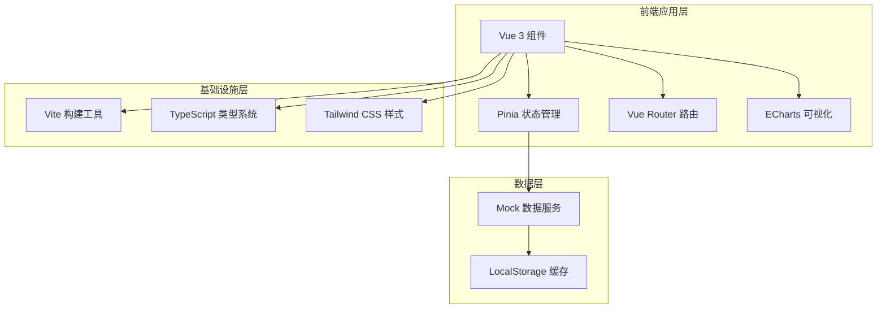
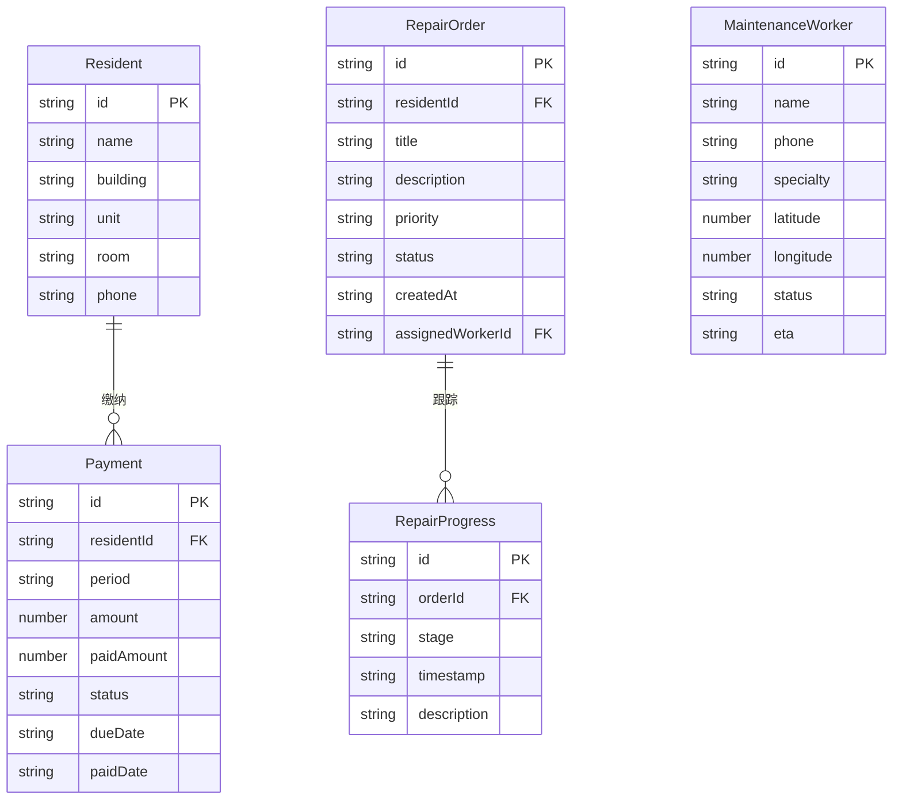

## 1. 架构设计



## 2. 技术说明

- **前端框架**：Vue 3.4 + Composition API + `<script setup lang="ts">`
- **构建工具**：Vite 5
- **类型系统**：TypeScript 5.3
- **样式方案**：Tailwind CSS 3.4
- **状态管理**：Pinia
- **路由管理**：Vue Router 4
- **数据可视化**：ECharts 5 + vue-echarts
- **图标库**：lucide-vue-next
- **数据层**：本地 Mock 数据 + LocalStorage 持久化
- **后端**：无（纯前端项目，Mock数据模拟）

## 3. 路由定义

| 路由 | 用途 |
|------|------|
| `/` | 仪表盘首页，展示关键指标和近期动态 |
| `/property-fees` | 物业费管理页，住户缴费状态和欠费提醒 |
| `/maintenance` | 报修管理页，报修单列表和进度跟踪 |
| `/analytics` | 数据分析页，ECharts图表和指标仪表盘 |

## 4. 数据模型

### 4.1 数据模型定义



### 4.2 核心类型定义

```typescript
type PaymentStatus = "paid" | "unpaid" | "partial"
type RepairPriority = "low" | "medium" | "high" | "urgent"
type RepairStatus = "pending" | "assigned" | "in_progress" | "completed" | "closed"
type WorkerStatus = "available" | "busy" | "off_duty"

interface Resident {
  id: string
  name: string
  building: string
  unit: string
  room: string
  phone: string
}

interface Payment {
  id: string
  residentId: string
  period: string
  amount: number
  paidAmount: number
  status: PaymentStatus
  dueDate: string
  paidDate: string | null
}

interface RepairOrder {
  id: string
  residentId: string
  title: string
  description: string
  priority: RepairPriority
  status: RepairStatus
  createdAt: string
  assignedWorkerId: string | null
  images: string[]
  progress: RepairProgress[]
}

interface RepairProgress {
  stage: RepairStatus
  timestamp: string
  description: string
}

interface MaintenanceWorker {
  id: string
  name: string
  phone: string
  specialty: string
  latitude: number
  longitude: number
  status: WorkerStatus
  eta: string | null
  currentOrderId: string | null
}
```

## 5. 项目目录结构

```
src/
├── assets/              # 静态资源
├── components/          # 通用组件
│   ├── layout/          # 布局组件（Sidebar, Header, AppLayout）
│   ├── common/          # 通用UI组件（StatusBadge, StatCard, FilterBar）
│   └── charts/          # ECharts图表组件
├── composables/         # 组合式函数
│   ├── useTheme.ts      # 主题管理
│   └── useLocalStorage.ts # 本地存储
├── lib/                 # 工具函数
│   └── utils.ts
├── mock/                # Mock数据
│   ├── residents.ts
│   ├── payments.ts
│   ├── repairs.ts
│   └── workers.ts
├── pages/               # 页面组件
│   ├── DashboardPage.vue
│   ├── PropertyFeesPage.vue
│   ├── MaintenancePage.vue
│   └── AnalyticsPage.vue
├── router/              # 路由配置
│   └── index.ts
├── stores/              # Pinia状态管理
│   ├── payment.ts
│   ├── repair.ts
│   └── worker.ts
├── types/               # TypeScript类型定义
│   └── index.ts
├── App.vue
├── main.ts
└── style.css
```
